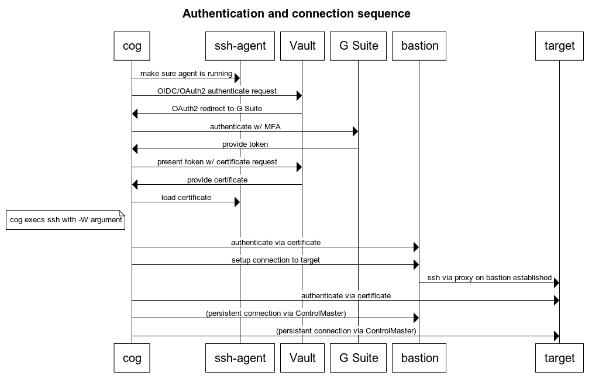

# The history of cog

When I arrived at [Standard Cognition](https://standard.ai) in January of 2019, SSH access to our baremetal servers was a hot mess.

We had the nacent beginnings of managing users with [Salt](https://www.saltstack.com/), but engineers wouldn't hesitate to run `sudo /usr/sbin/useradd` in order to add accounts with passwords, perhaps with some custom scripts to push around SSH keys if we were lucky.

As the SRE team came into being, I knew we needed to move away from this to something better. At the time, I knew that it would be great to have something like Netflix's [BLESS](https://github.com/Netflix/bless) in place (although we're not an AWS shop), but it didn't make sense to bite off that big a task.

So I put into place something that I've done before: user management via [Ansible](https://www.ansible.com/). After getting user management into a much better place, we put the issue away and turned our attention to other problems.

There were some glaring holes with my implementation of user management in Ansible: we had to push around SSH keys, which meant running Ansible across the infrastructure. Removing a user's access meant the same. Onboarding was not simple: an engineer would submit a PR with their key and a bit of YAML that defined their UID and GID, we'd accept the PR, run Ansible across the plant, and give the user an initial 2FA code (we were using `libpam-google-authenticator`). The user would SSH into our bastion host, cat a file that would give them a URL, visit that URL in the browser, scan the QR code into their 2FA app, and then use that for subsequent logins.

It wasn't pretty, but it worked.

In Q4 of 2019, I was able to bring my attention back to user management. I wanted a better user experience and a better administrative experience. I wanted to retain multi-factor authentication.<sup>1</sup> I wanted to stop pushing SSH public keys around.

Nothing existing quite fit our needs. I knew that [HashiCorp Vault](https://www.vaultproject.io/) could do [signed SSH Certificates](https://www.vaultproject.io/docs/secrets/ssh/signed-ssh-certificates.html). We'd been using [Google Identity-Aware Proxy](https://cloud.google.com/iap/). Bringing those pieces together made sense.

Enter [cog](LINK), which we've open sourced under the MIT License. Once deployed, cog is transparent to the end user. They download the cog binary (specific to their environment), run `cog init`, and then they can use SSH just like they normally do. Behind the scenes, cog creates an Identity-Aware Proxy to HashiCorp Vault, logs in via OIDC, and gets an SSH certificate signed. Then, it SSH'es to the target host, using a desired bastion host as the intermediate hop.

While this goes on behind the scenes:



Our developers see this:

```
$ ssh ubuntu@cog_target
...
Last login: Fri Sep 18 17:11:12 2020 from 192.168.0.4
$
```

End users no longer have to type in their 2FA code every time they SSH. Administrators no long have to push around or remove SSH public keys. Granting or revoking access is simple.<sup>2</sup>

Some day, we won't have to SSH into our infrastructure at all. It's a goal we'll continue to work toward. In the meantime, cog makes SSH infrastructure simple.

*Pete Emerson is on the SRE team at [Standard Cognition](https://standard.ai).*

------

<sup>1</sup> [OpenSSH 8.2](https://www.openssh.com/txt/release-8.2) supports FIDO/U2F hardware authenticators, which is perhaps another interesting piece of the puzzle.

<sup>2</sup> ACLs could be made easier with integration with LDAP or similar. Unfortunately, Google doesn't provide group information on OIDC login, so we can't do our permissioning that way.